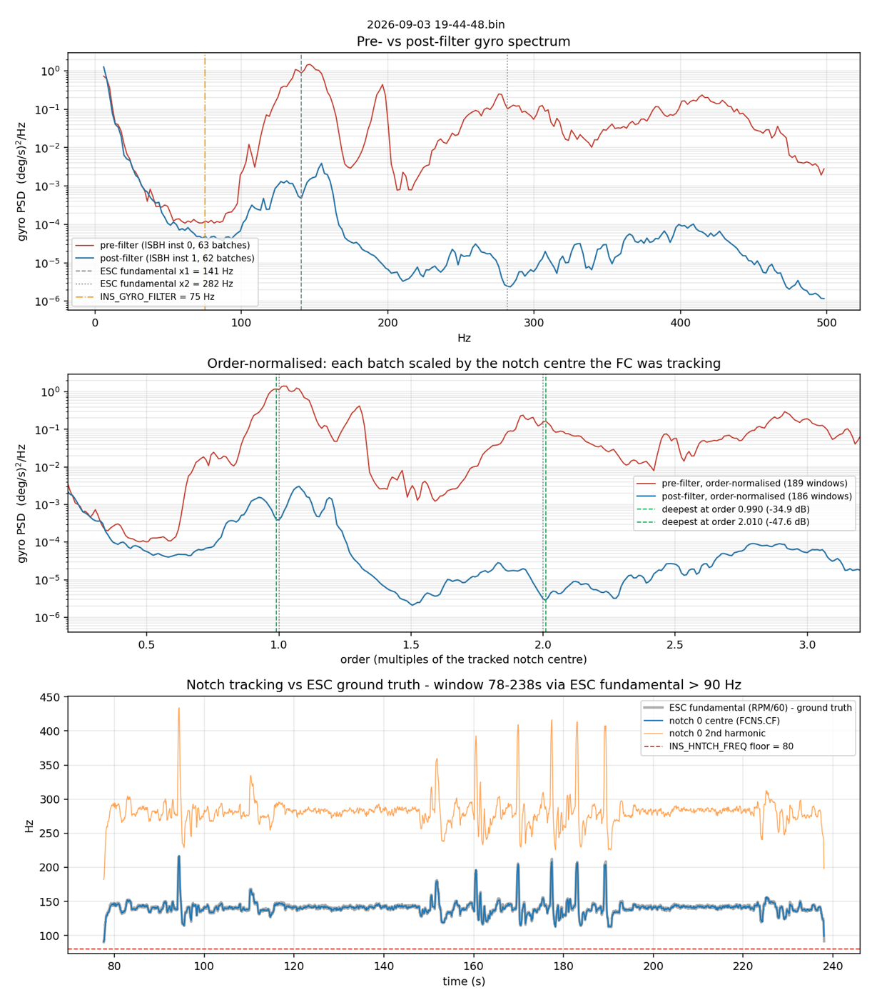

# ardupilot-log-tools

**An agent-first toolkit for analysing ArduPilot / ArduCopter dataflash (`.bin`) logs.**

The goal of this project is to let an AI agent analyse a flight log *efficiently* and
*accurately*. Everything follows from that: the parser fails loudly instead of quietly
patching bad input, every number comes with its window, its threshold and the threshold's
source, every command has a JSON form with a published schema, and the documentation is
written for the agent doing the analysis rather than for a person looking at plots.

```bash
python alog.py info flight.bin        # what is this, is it intact, what was logged
python alog.py all  flight.bin        # the standard battery, markdown
python alog.py all  flight.bin --json # the same, one JSON document
```

```
# Log analysis - 2026-09-04 12-17-29.bin

**Log integrity:** 0 error(s), 1 warning(s), 1 info in log integrity.
- [WARNING] TRUNCATED_TAIL: file ends 15 bytes into a RTC message (5 of 20 bytes present) ...

Window: 77.4-277.8 s (200.4 s) via **EV NOT_LANDED->LAND_COMPLETE**. Quote this method when comparing flights.

## Motors and standing trim
[FAIL] roll trim: 34.256 us standing trim (warn 10, fail 25)
[FAIL] pitch trim: -36.738 us standing trim (warn 10, fail 25)
[PASS] yaw trim: 0.562 us standing trim (warn 10, fail 25)

| axis     | trim (us) | reads as                                         |
| -------- | --------: | ------------------------------------------------ |
| roll     |      34.3 | mean(left) - mean(right)                         |
| pitch    |     -36.7 | mean(front) - mean(rear); negative = CG aft      |
| yaw      |       0.6 | mean(CCW) - mean(CW); non-zero = standing torque |

Channel -> motor map from SERVOn_FUNCTION: M1=C2, M2=C3, M3=C4, M4=C1.
```

Exit code 0 / 1 / 2 is pass / warn / fail; 3 means the input could not be analysed.

---

## Core values

1. **Fail loudly.** Nothing wrong with the input is ever silently repaired. Truncation,
   resync, unknown message types, malformed `FMT` records, NaN fields, logging gaps and
   duplicated blocks are all recorded with a stable code, a byte offset and a count, printed
   at the top of every report and carried in every JSON document
   (`reference/integrity-codes.md`). `--strict` refuses a log with any error-level issue.
   A check that cannot run is `SKIP`, never a pass.
2. **State the number, the window and the source.** Every result carries its value, its
   thresholds and where the thresholds came from (`dflog/checks.py::T`,
   `reference/thresholds.md`). Every report names the window and the method that chose it.
3. **Agents first.** `--json` everywhere with one contract (`alog schema`,
   `reference/json-output.md`); structured tables, not markdown inside JSON; deterministic
   output; errors that say what *does* exist. `RULES.md` is the short contract; `CLAUDE.md`
   the operating guide.
4. **Platform agnostic.** Pure Python 3.9+ on Windows, Linux and macOS; no shell scripts on
   the critical path; UTF-8 output; CI runs all three.

---

## Install

```bash
git clone https://github.com/<you>/ardupilot-log-tools.git
cd ardupilot-log-tools
pip install -r requirements.txt          # numpy, pandas, scipy (+ matplotlib for plots)
python alog.py --help
```

Or `pip install -e .` for an `alog` console script, or with uv: `uv venv && uv pip install
-r requirements.txt` then `uv run python alog.py ...`. No pymavlink, nothing to compile.

---

## Use

```bash
python alog.py info      flight.bin                 # identity, integrity, coverage - run first
python alog.py integrity flight.bin                 # every structural and data-quality issue
python alog.py all       flight.bin [--json]        # the standard battery
python alog.py motors    flight.bin --window rpm    # one check, most reproducible window
python alog.py fft       flight.bin --plot fft.png  # local FFT (scipy) of the best gyro source
python alog.py fft       flight.bin --list-sources  # every transformable signal with its Nyquist
python alog.py compare   before.bin after.bin       # like-for-like, identical code both sides
python alog.py types     flight.bin                 # messages present, rates, fields
python alog.py fields    flight.bin ESC             # one message's fields, units, MULT, ranges
python alog.py dump      flight.bin RATE --fields t,RDes,R --every 10 > rate.csv
python alog.py params    flight.bin --diff snapshot.param
python alog.py params    flight.bin --non-default   # what differs from firmware defaults
python alog.py files     flight.bin --out embedded/ # extract FILE records (hwdef, threads...)
python alog.py schema                               # the JSON contract, checks, thresholds
python plot_notch.py     flight.bin -o notch.png    # notch verification chart
```

Checks (`alog all` runs them in this order): `summary`, `integrity`, `coverage`, `events`,
`flight`, `paramcheck`, `brownout`, `vibe`, `imu`, `motors`, `notch`, `pid`, `gust`, `ekf`,
`estimates`, `compass`, `power`, `gps`, `cpu`, `spectrum`, `batchfft`. Each is also a
subcommand.

Windows: `--window auto|ev|rpm|throttle|arm|none` or an explicit `--window 120:180`
(seconds since boot). `rpm` (fleet-mean ESC fundamental above 90 Hz) is the one to use for
motor, notch and vibration work and for any before/after comparison.

Flights: a log can hold more than one. The window is always **one** of them - never the
span across the ground time between two - and the method string says which. `--flight N`
picks one (default: the longest), `--flight all` runs the battery once per flight, and
`alog info` lists them. A log with more than one flight analysed one flight at a time is
a WARN, so it cannot pass unnoticed.

As a library:

```python
from dflog import Log, airborne_window, mix_for, trim_decomposition, spectral

log  = Log("flight.bin")                # parses once, caches beside the log as .dfcache
log.diagnostics.ok                      # False if anything in the file was wrong
print(log.diagnostics.render())         # every issue with code, severity, byte offset
w    = airborne_window(log, method="rpm")
esc  = log.instances("ESC")             # {0: df, 1: df, 2: df, 3: df}
rate = w.clip(log.df("RATE"))           # pandas DataFrame, airborne only
r    = spectral.analyse(log, window=w)  # Welch PSD + peaks in motor orders, or SpectralError
```

---

## What it checks

| check | what it measures | thresholds from |
|---|---|---|
| integrity | structural issues from the parse, NaN/gap/duplicate scan | this parser; LogAnalyzer TestNaN/TestDupeLogData |
| coverage | which messages exist, at what rate, and the fastest gyro source vs the motor fundamental (Nyquist) | Nyquist |
| events, flight | EV/ERR/MSG decoded (subsystem names, prearm failures, crash, thrust loss), ever armed/flew, autotune outcome, lean vs ANGLE_MAX, uncommanded mode changes | LogAnalyzer TestEvents/TestAutotune/TestPitchRollCoupling, dronekit-la |
| paramcheck, brownout | NaN parameters, in-flight parameter changes, learned hover throttle vs snapshot, still armed at log end | LogAnalyzer TestParams/TestBrownout |
| vibe, imu | VIBE p95 and clip deltas; gyro bias, IMU health flags and counters, dual-IMU accel mismatch | ArduPilot wiki, LogAnalyzer TestIMUMatch |
| motors | standing-trim decomposition through the SERVOn_FUNCTION channel map, RPM spread on medians, bidirectional DShot error rate, headroom against the MOT_SPIN_MAX ceiling, MOTB throttle limiting | measured, dronekit-la |
| notch | `FCNS.CF` tracking against `ESC.RPM/60` (the notch as applied, not the FFT's opinion) | measured |
| pid, gust | desired-vs-actual rate correlation split at 5 Hz, `Dmod` slew-limiter engagement, PID output limiting, attitude error, unrequested excursions per second | dronekit-la, measured |
| ekf, estimates | XKF4 innovation ratios with the count over 1.0, solution-status flags, resets; ATT vs AHR2/XKF1 and baro vs EKF divergence | dronekit-la |
| compass, power, gps, cpu | field magnitude/variation/health, motor interference, offset magnitudes; current-vs-throttle correlation, board Vcc; sats, HDOP, fix availability, position jumps, glitch ERRs; load, slow loops, free memory, internal errors | LogAnalyzer, dronekit-la, wiki |
| spectrum | local Welch PSD (scipy) of the fastest gyro source, peaks labelled in motor orders, honest about Nyquist and timing jitter | wiki FFT_SNR_REF |
| batchfft | pre/post-filter batch-IMU spectra, order-normalised notch attenuation and placement | pymavlink mavfft_isb method |

---

## Three things it does that are worth stealing

### Standing-trim decomposition, instead of "RPM spread"

Raw spread tells you the motors disagree but not *how*, and a bent blade, an aft CG and a
twisted arm all show up as spread. Projecting the standing per-motor deviation onto the
frame's own mix factors separates them. On a quad each figure is literally a difference
between two halves of the airframe:

```
roll  trim = mean(left motors)  - mean(right motors)     thrust asymmetry
pitch trim = mean(front motors) - mean(rear motors)      negative => CG aft
yaw   trim = mean(CCW motors)   - mean(CW motors)        torque asymmetry
```

`RCOU.C<n>` is servo output n, not motor n. Many 4-in-1 boards ship a non-sequential
`SERVOn_FUNCTION` map so the connector matches Betaflight order; feeding `C1..C4` straight
into the mix then reports true roll as yaw and sends you looking for a twisted arm that
does not exist. The motors check reads the map from the log and prints it.

### Measure the filter, not the FFT

`FTN1.PkAvg` is the in-flight FFT's *opinion* of where the noise is. `FCNS.CF` is the
frequency the harmonic notch actually *applied*. They are the same series only when
`INS_HNTCH_MODE=4`; once the notch is driven by ESC telemetry they decouple, and only
`FCNS.CF` answers the question. Ground truth is always `ESC.RPM / 60`.

### Order-normalised batch-IMU spectra

For the post-filter proof you need `INS_LOG_BAT_MASK=1` and `INS_LOG_BAT_OPT=4`. Batch
logging drops samples routinely, so any window with an `ISBD.seqno` gap is discarded, and
because the notch centre moves with RPM every batch is normalised by the centre the FC was
tracking at that instant before averaging. On a verified flight the attenuation minimum
landed at order 0.990 and the second at 2.010.



---

## Layout

```
alog.py / plot_notch.py   thin launchers (python alog.py ...)
RULES.md                  the contract: fail loudly, state the number, agents first
CLAUDE.md                 the operating guide for an agent analysing a log
AGENTS.md                 pointer for other agent frameworks
dflog/
  parser.py               .bin reader + Diagnostics + on-disk cache (fails loudly)
  textlog.py              .log text-export reader (flagged as second-class)
  flight.py               flight segmentation and window selection, events, modes, hover chunks
  frames.py               motor-mix geometry, channel map, trim decomposition
  analysis.py             the check battery (Sections with tables + notes)
  checks.py               Result contract + the cited threshold registry T
  spectral.py             scipy-based FFT: sources, Welch PSD, peaks, jitter/Nyquist honesty
  stats.py / report.py    statistics and markdown helpers
  cli.py                  the agent-facing CLI (markdown + JSON, exit codes)
reference/
  integrity-codes.md      every diagnostic code, severity and meaning
  json-output.md          the JSON contract
  dataflash-format.md     the binary format, in enough detail to write a parser
  messages.md             message and field reference with units and decodings
  thresholds.md           every threshold and where it came from
  param-decodings.md      device IDs, bitmasks, enums, derived quantities
  pitfalls.md             mistakes made, so they need not be made again
  existing-tools.md       audit of the open-source ecosystem and what was taken from it
templates/                report template
tests/
  synthlog.py             a DataFlash writer for building malformed test logs
  test_parser_integrity.py, test_cli.py, test_flights.py
                          run anywhere, no flight data needed
  test_toolkit.py         pinned regression figures; needs LOG_DIR
tools/bootstrap_pymavlink.py (and .sh)   vendor pymavlink when you want mavextra/mavfft_isb
```

---

## The parser

`dflog/parser.py` reads the DataFlash format directly via its self-describing `FMT`
records: about 1 s for a 16 MB log, cached beside the log as `<name>.bin.dfcache` keyed on
size, mtime and cache version. It decodes by the format string (all 21 characters including
`g` float16), applies format-character scaling (`c C e E L`) and never `MULT`, reassembles
4.7+ chunked `MSG` text and `FILE` records, splits instances by the FMTU `#` marker with a
label fallback, and derives UTC from GPS week/ms. What it finds wrong it reports; see
`reference/integrity-codes.md` for the codes and for how pymavlink, ardupilot-binlog and
JsDataflashParser behave on the same inputs.

---

## Tests

```bash
python tests/test_parser_integrity.py        # synthetic malformed logs: every integrity code
python tests/test_cli.py                     # exit codes and the JSON contract
python tests/test_flights.py                 # flight segmentation and window selection
python tests/test_toolkit.py                 # pinned regression figures (skips without LOG_DIR)
LOG_DIR=/path/to/logs python tests/test_toolkit.py
```

The regression suite pins hand-verified numbers from two reference logs: attitude error sd
0.413° / 0.381°, motor-ordered trims, `XKF4.SM` max 1.56 with 6 rejections, RPM spread
7.48 %, notch attenuation at order 1.000. If a refactor changes them, the refactor is wrong
until proven otherwise. pytest is optional; `tests/_shim.py` runs the suites standalone.

---

## Scope and limitations

- Written against ArduCopter 4.x logs from multirotors. The parser is vehicle-agnostic and
  mode tables exist for Plane, Rover and Sub; the motor, notch and trim checks assume a
  multirotor.
- Frame geometry covers the common quad / hexa / octa / deca layouts. Unknown frames fall
  back to quad-X and label themselves as having done so.
- Thresholds are a prompt to look, not a verdict.
- Text `.log` exports are read but flagged (`TEXT_LOG`): values are pre-scaled, records may
  be decimated, batch-IMU arrays do not round-trip. `.tlog` telemetry logs are not supported.

---

## Contributing

Read `RULES.md` §5. New checks go in `dflog/analysis.py` as `check_*(log, window) ->
Section`, registered in `ALL_CHECKS`; new thresholds in `dflog/checks.py::T` with a source;
new integrity conditions get a code, a test and a line in `reference/integrity-codes.md`.
Run all three test files before opening a PR.

## Licence

MIT. All code here is original; methods and thresholds learned from pymavlink, ArduPilot's
`Tools/LogAnalyzer`, dronekit-la and the ArduPilot firmware itself are credited in
[NOTICE.md](NOTICE.md) and `reference/existing-tools.md`.
